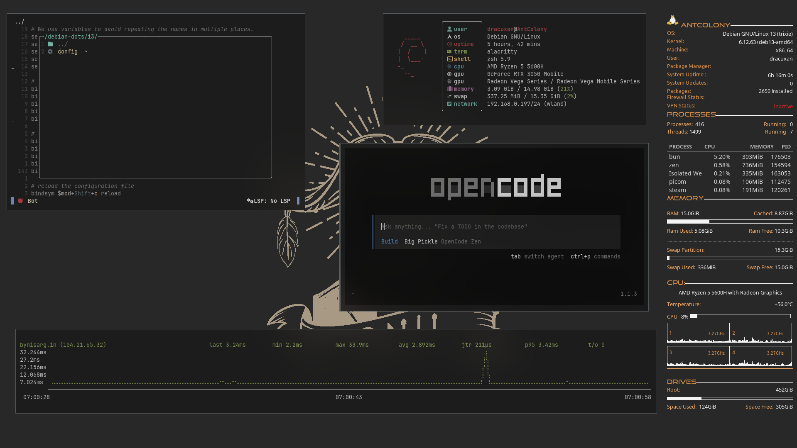
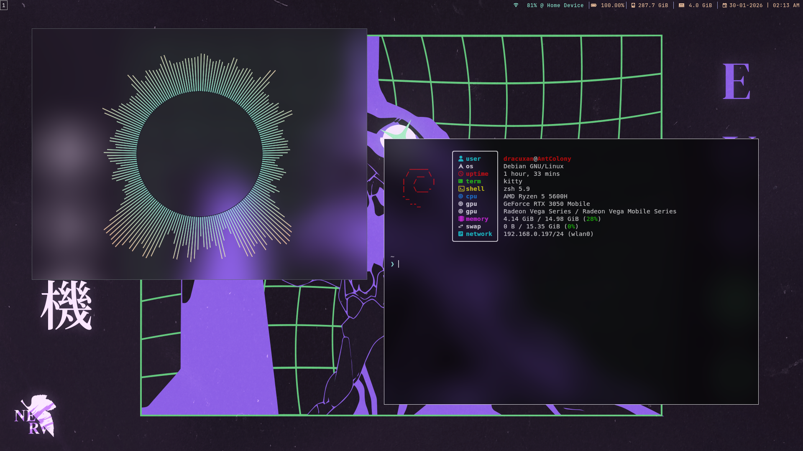
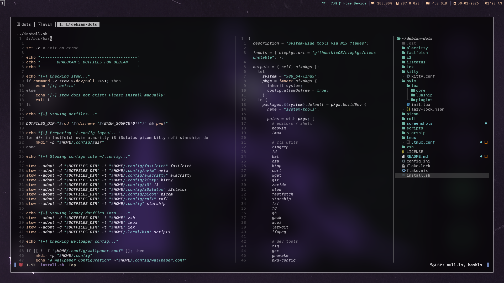

[](https://wakatime.com/badge/user/0d75cfc5-da70-41b7-b8c8-661ef9d8338b/project/9358976a-67c2-4357-8140-bd4a4c743b96)

# Dotfiles

Personal dotfiles for managing Neovim, i3, tmux, zsh and other tools using stow.

## Prerequisites

Required tools:

- git
- stow
- zsh
- i3
- picom
- Neovim
- tmux

## Installation

> [!WARNING]\
> Under _**active development**_ — Existing config files will be overwritten!

```bash
git clone https://github.com/dracuxan/Dot-Files.git ~/dotfiles && cd ~/dotfiles
./install.sh
```

## Directory Structure

```
dotfiles/
├── alacritty/          → Terminal config
├── fastfetch/          → System info
├── i3/                 → Window manager
├── i3status/           → Status bar
├── nvim/               → Neovim config
├── picom/              → Compositor
├── tmux/               → Terminal multiplexer
├── zsh/                → Shell config
├── scripts/            → Utility scripts
├── flake.nix           → Nix packages
└── README.md
```

## Features

- i3 window manager with picom compositor
- Neovim configuration with LSP support
- tmux with custom keybindings
- zsh with starship prompt
- Wallpaper management scripts
- Application launchers (steam, obs, etc.)

## Screenshots

**i3 WM**


**Fastfetch**


**Neovim Plus Tmux**


## Customization

Modify colors and themes in:

- i3: `~/.config/i3/config`
- zsh: `~/.zshrc` and starship config
- nvim: `~/.config/nvim/lua/`

## Nix Integration

Install packages with: `nix profile install .#default`

## Troubleshooting

Common fixes:

- Font issues: Install ttf-font-awesome
- Keybinding conflicts: Check i3 config
- Display issues: Verify xorg server

## Scripts

> [!WARNING]\
> Under _**active development**_ — scripts may or may not work for you. use at your own risk

Key utilities:

- `set_wallpaper.sh` - Wallpaper management
- `setup_monitors.sh` - Multi-monitor setup
- App launchers in `scripts/` for steam, obs, etc.
